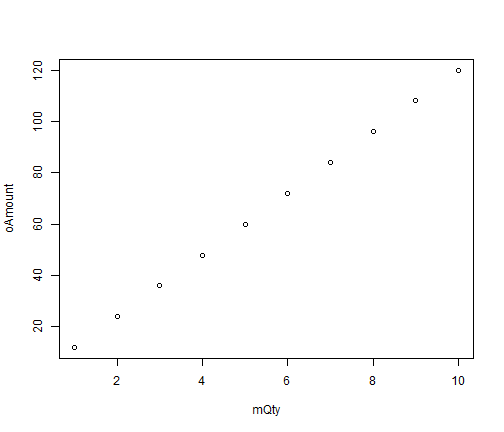
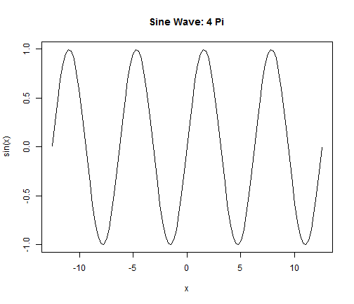

## Pizza Ordering, a Shiny App

For a copy of the Shiny App
..ul: build
- URL: *https://tommyho.shinyapps.io/devdataprod-002/*
- Hosted by **shinyapps.io**
- GitHub: *https://github.com/tommykho/devdataprod-002/*
- ShinyApp that calculates the order amount from number of pizza and their size
- Download code:

```
git clone https://github.com/tommykho/devdataprod-002.git
```

--- .class #id 

## R in action within Slidify (data)

```r
mQty <- 1:10
oAmount <- paste('$', 12 * mQty)
df <- data.frame(mQty, oAmount)
df
```

```
##    mQty oAmount
## 1     1    $ 12
## 2     2    $ 24
## 3     3    $ 36
## 4     4    $ 48
## 5     5    $ 60
## 6     6    $ 72
## 7     7    $ 84
## 8     8    $ 96
## 9     9   $ 108
## 10   10   $ 120
```

--- .class #id 

## R in action within Slidify (plot)

```r
mQty <- 1:10
oAmount <- 12 * mQty
plot(mQty, oAmount)
```

 

--- .class #id 

## R in action within Slidify (curve)

```r
curve(sin(x), -12.56, 12.56, main = "Sine Wave: 4 Pi")
```

 
